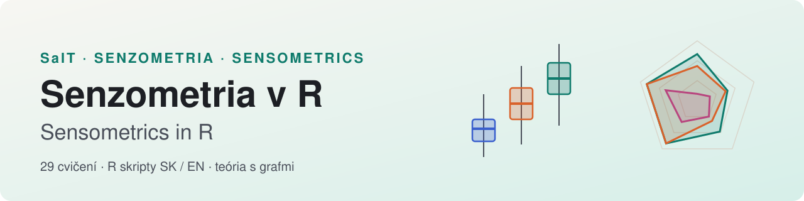
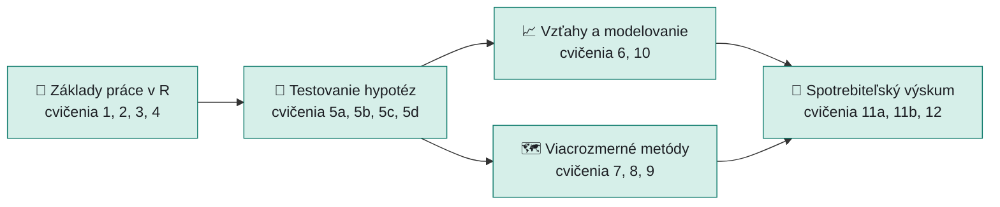
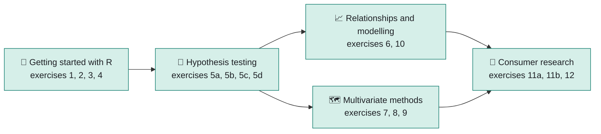

  <picture>
    <source media="(prefers-color-scheme: dark)" srcset="assets/banner-dark.svg">
    
  </picture>

  
  
  
  
  

<b><a href="#-slovensky">🇸🇰 Slovensky</a></b> &nbsp;|&nbsp; <b><a href="#-english">🇬🇧 English</a></b>

---

## 🇸🇰 Slovensky

Materiály k cvičeniam zo **senzorickej analýzy a senzometrie** v jazyku R. Ku každému cvičeniu patrí R skript (slovenská aj anglická verzia) a **teoretická stránka s grafmi**: čo metóda robí, kedy ju použiť, ako čítať výstup a na čo si dať pozor.

<a href="https://senzorika.github.io/SaIT/teoria/index.html"><b>📖 Otvoriť teóriu</b></a> &nbsp;·&nbsp; <a href="#-cvičenia">🧪 Cvičenia</a> &nbsp;·&nbsp; <a href="#-ako-začať">🚀 Ako začať</a> &nbsp;·&nbsp; <a href="#-užitočné-odkazy">🔗 Odkazy</a>

### 🧭 Mapa kurzu

### 🧪 Cvičenia

#### 🧰 Základy práce v R

| # | Téma | Teória | Skript SK | Script EN |
|:-:|------|:------:|:---------:|:---------:|
| **1** | **R, RStudio a spolupráca** Pracovné prostredie pre senzometriu: štatistický jazyk R, vývojové prostredie RStudio, balíky a nástroje na tímovú prácu. | [📖](https://senzorika.github.io/SaIT/teoria/cvicenie01.html) | [`cvicenie1.txt`](cvicenie1.txt) | [`exercise1.txt`](exercises_EN/exercise1.txt) |
| **2** | **BCG matica a interval spoľahlivosti** Ako umiestniť produkty do mapy cena × kvalita a ako vyjadriť neistotu priemerného hodnotenia panelu. | [📖](https://senzorika.github.io/SaIT/teoria/cvicenie02.html) | [`cvicenie2.txt`](cvicenie2.txt) | [`exercise2.txt`](exercises_EN/exercise2.txt) |
| **3** | **Práca s dátami v R** Skaláry, vektory, matice a dátové rámce – stavebné kamene každej senzorickej analýzy. | [📖](https://senzorika.github.io/SaIT/teoria/cvicenie03.html) | [`cvicenie3.txt`](cvicenie3.txt) | [`exercise3.txt`](exercises_EN/exercise3.txt) |
| **4** | **Grafy a vizualizácia dát** Ktorý graf zvoliť, ako ho čítať a čo z neho vyčítať skôr, než siahneme po štatistickom teste. | [📖](https://senzorika.github.io/SaIT/teoria/cvicenie04.html) | [`cvicenie4.txt`](cvicenie4.txt) | [`exercise4.txt`](exercises_EN/exercise4.txt) |

#### 🧪 Testovanie hypotéz

| # | Téma | Teória | Skript SK | Script EN |
|:-:|------|:------:|:---------:|:---------:|
| **5a** | **Normalita a porovnanie dvoch vzoriek** Overenie normality, t-test verzus Wilcoxon, binomický test v rozlišovacích skúškach, χ² test a McNemarov test. | [📖](https://senzorika.github.io/SaIT/teoria/cvicenie05a.html) | [`cvicenie5a.txt`](cvicenie5a.txt) | [`exercise5a.txt`](exercises_EN/exercise5a.txt) |
| **5b** | **Porovnanie viacerých vzoriek** Kruskal-Wallis, Friedman, analýza rozptylu (ANOVA) a viacnásobné porovnania. | [📖](https://senzorika.github.io/SaIT/teoria/cvicenie05b.html) | [`cvicenie5b.txt`](cvicenie5b.txt) | [`exercise5b.txt`](exercises_EN/exercise5b.txt) |
| **5c** | **Import dát z Excelu a postup analýzy** Načítanie online súboru, dlhý formát dát a kompletný postup: normalita → test → post-hoc. | [📖](https://senzorika.github.io/SaIT/teoria/cvicenie05c.html) | [`cvicenie5c.txt`](cvicenie5c.txt) | [`exercise5c.txt`](exercises_EN/exercise5c.txt) |
| **5d** | **Durbinov test a neúplné bloky** Keď hodnotiteľ nemôže ochutnať všetky vzorky: vyvážené neúplné blokové usporiadanie. | [📖](https://senzorika.github.io/SaIT/teoria/cvicenie05d.html) | [`cvicenie5d.txt`](cvicenie5d.txt) | [`exercise5d.txt`](exercises_EN/exercise5d.txt) |

#### 📈 Vzťahy a modelovanie

| # | Téma | Teória | Skript SK | Script EN |
|:-:|------|:------:|:---------:|:---------:|
| **6** | **Korelácia a lineárna regresia** Sila a smer vzťahu medzi inštrumentálnymi a senzorickými znakmi a jednoduchý predikčný model. | [📖](https://senzorika.github.io/SaIT/teoria/cvicenie06.html) | [`cvicenie6.txt`](cvicenie6.txt) | [`exercise6.txt`](exercises_EN/exercise6.txt) |
| **10** | **Analýza prežitia a senzorická trvanlivosť** Kaplan-Meierov odhad pravdepodobnosti akceptácie produktu v čase a určenie cut-off bodu. | [📖](https://senzorika.github.io/SaIT/teoria/cvicenie10.html) | [`cvicenie10.txt`](cvicenie10.txt) | [`exercise10.txt`](exercises_EN/exercise10.txt) |

#### 🗺️ Viacrozmerné metódy

| # | Téma | Teória | Skript SK | Script EN |
|:-:|------|:------:|:---------:|:---------:|
| **7** | **PCA a faktorová analýza** Zníženie rozmernosti dát: hlavné komponenty, Kaiserovo kritérium a skryté faktory v spotrebiteľských odpovediach. | [📖](https://senzorika.github.io/SaIT/teoria/cvicenie07.html) | [`cvicenie7.txt`](cvicenie7.txt) | [`exercise7.txt`](exercises_EN/exercise7.txt) |
| **8** | **Zhluková analýza** Hierarchické zhlukovanie (Ward), dendrogram a metóda k-priemerov pre segmentáciu produktov. | [📖](https://senzorika.github.io/SaIT/teoria/cvicenie08.html) | [`cvicenie8.txt`](cvicenie8.txt) | [`exercise8.txt`](exercises_EN/exercise8.txt) |
| **9** | **Korešpondenčná analýza** Mapa vzťahov medzi kategóriami kontingenčnej tabuľky – produkty a cieľové skupiny. | [📖](https://senzorika.github.io/SaIT/teoria/cvicenie09.html) | [`cvicenie9.txt`](cvicenie9.txt) | [`exercise9.txt`](exercises_EN/exercise9.txt) |

#### 🛒 Spotrebiteľský výskum

| # | Téma | Teória | Skript SK | Script EN |
|:-:|------|:------:|:---------:|:---------:|
| **11a** | **TURF analýza a mapa preferencií** Optimálna kombinácia ingrediencií (reach & frequency) a prepojenie senzorického profilu s hedonikou. | [📖](https://senzorika.github.io/SaIT/teoria/cvicenie11a.html) | [`cvicenie11a.txt`](cvicenie11a.txt) | [`exercise11a.txt`](exercises_EN/exercise11a.txt) |
| **11b** | **Text mining a analýza sentimentu** Od voľného textu recenzií k frekvenciám slov, word cloudu a emóciám podľa lexikónu NRC. | [📖](https://senzorika.github.io/SaIT/teoria/cvicenie11b.html) | [`cvicenie11b.txt`](cvicenie11b.txt) | [`exercise11b.txt`](exercises_EN/exercise11b.txt) |
| **12** | **JAR škála a radarový graf** Just-About-Right hodnotenie pre optimalizáciu receptúry a profilogram senzorických vlastností. | [📖](https://senzorika.github.io/SaIT/teoria/cvicenie12.html) | [`cvicenie12.txt`](cvicenie12.txt) | [`exercise12.txt`](exercises_EN/exercise12.txt) |

### 🚀 Ako začať

1. Nainštalujte [R](https://cran.r-project.org/) a potom [RStudio](https://posit.co/download/rstudio-desktop/).
2. Otvorte skript cvičenia v RStudiu a spúšťajte ho po riadkoch (<kbd>Ctrl</kbd> + <kbd>Enter</kbd>).
3. Chýbajúce balíky doinštalujte cez `install.packages("nazov")` – zoznam je v [`cvicenie1.txt`](cvicenie1.txt).
4. Pred každým cvičením si prečítajte teóriu (📖) – vysvetľuje aj výstupy, ktoré skript vypíše.

> [!NOTE]
> Teoretické stránky sa zobrazujú cez **GitHub Pages**. Pri otvorení `.html` súboru priamo v repozitári GitHub ukáže iba zdrojový kód. Záložná možnosť: [raw.githack.com](https://raw.githack.com/senzorika/SaIT/master/teoria/index.html).

### 📦 Ďalší obsah repozitára

| Priečinok | Obsah |
|---|---|
| 📊 [`datasety/`](datasety/) | datasety k praktickým úlohám (napr. [`001_datasety.txt`](datasety/001_datasety.txt) k cvičeniu 5b) |
| 🖥️ [`Senzometricke_appky/`](Senzometricke_appky/) | interaktívne Shiny aplikácie (PCA, TDS, TCATA, NPS, LDA…) |
| 🇬🇧 [`English/`](English/) | rozšírené anglické materiály a prezentácie |
| 🌐 [`exercises_EN/`](exercises_EN/) · [`teoria/`](teoria/) · [`theory_EN/`](theory_EN/) | anglické skripty, zdrojové súbory teórie SK / EN |

### 🔗 Užitočné odkazy

| | Nástroj | Na čo |
|:-:|---|---|
| 📐 | [R](https://cran.r-project.org/) · [RStudio](https://posit.co/download/rstudio-desktop/) | štatistické prostredie a editor |
| 🤖 | [OpenCode](https://opencode.ai/) | open-source AI asistent na programovanie v termináli – pomoc pri písaní a vysvetľovaní R kódu |
| 💬 | [White Noise](https://www.whitenoise.chat/) | súkromný šifrovaný messenger na protokole Nostr – komunikácia v tíme |
| 🗂️ | [GitHub](https://github.com/) | verziovanie skriptov a dát |
| 🥫 | [Open Food Facts](https://world.openfoodfacts.org/) | otvorená databáza potravín (cvičenie 4) |

---

## 🇬🇧 English

Course materials for **sensory analysis and sensometrics** exercises in R. Every exercise has an R script (in English and Slovak) and a **theory page with graphics**: what the method does, when to use it, how to read the output and what to watch out for.

<a href="https://senzorika.github.io/SaIT/theory_EN/index.html"><b>📖 Open the theory</b></a> &nbsp;·&nbsp; <a href="#-exercises">🧪 Exercises</a> &nbsp;·&nbsp; <a href="#-getting-started">🚀 Getting started</a> &nbsp;·&nbsp; <a href="#-useful-links">🔗 Links</a>

### 🧭 Course map

### 🧪 Exercises

#### 🧰 Getting started with R

| # | Topic | Theory | Script EN | Skript SK |
|:-:|------|:------:|:---------:|:---------:|
| **1** | **R, RStudio and collaboration** The working environment for sensometrics: the R language, the RStudio IDE, packages and tools for teamwork. | [📖](https://senzorika.github.io/SaIT/theory_EN/exercise01.html) | [`exercise1.txt`](exercises_EN/exercise1.txt) | [`cvicenie1.txt`](cvicenie1.txt) |
| **2** | **BCG matrix and confidence interval** How to place products on a price × quality map and how to express the uncertainty of a panel mean. | [📖](https://senzorika.github.io/SaIT/theory_EN/exercise02.html) | [`exercise2.txt`](exercises_EN/exercise2.txt) | [`cvicenie2.txt`](cvicenie2.txt) |
| **3** | **Working with data in R** Scalars, vectors, matrices and data frames – the building blocks of every sensory analysis. | [📖](https://senzorika.github.io/SaIT/theory_EN/exercise03.html) | [`exercise3.txt`](exercises_EN/exercise3.txt) | [`cvicenie3.txt`](cvicenie3.txt) |
| **4** | **Charts and data visualisation** Which chart to choose, how to read it and what it tells us before we reach for a statistical test. | [📖](https://senzorika.github.io/SaIT/theory_EN/exercise04.html) | [`exercise4.txt`](exercises_EN/exercise4.txt) | [`cvicenie4.txt`](cvicenie4.txt) |

#### 🧪 Hypothesis testing

| # | Topic | Theory | Script EN | Skript SK |
|:-:|------|:------:|:---------:|:---------:|
| **5a** | **Normality and two-sample comparison** Normality checks, t-test versus Wilcoxon, the binomial test in discrimination tests, the χ² test and McNemar’s test. | [📖](https://senzorika.github.io/SaIT/theory_EN/exercise05a.html) | [`exercise5a.txt`](exercises_EN/exercise5a.txt) | [`cvicenie5a.txt`](cvicenie5a.txt) |
| **5b** | **Comparing several samples** Kruskal-Wallis, Friedman, analysis of variance (ANOVA) and multiple comparisons. | [📖](https://senzorika.github.io/SaIT/theory_EN/exercise05b.html) | [`exercise5b.txt`](exercises_EN/exercise5b.txt) | [`cvicenie5b.txt`](cvicenie5b.txt) |
| **5c** | **Importing Excel data and the analysis workflow** Loading an online file, the long data format and the complete workflow: normality → test → post-hoc. | [📖](https://senzorika.github.io/SaIT/theory_EN/exercise05c.html) | [`exercise5c.txt`](exercises_EN/exercise5c.txt) | [`cvicenie5c.txt`](cvicenie5c.txt) |
| **5d** | **Durbin test and incomplete blocks** When an assessor cannot taste every sample: the balanced incomplete block design. | [📖](https://senzorika.github.io/SaIT/theory_EN/exercise05d.html) | [`exercise5d.txt`](exercises_EN/exercise5d.txt) | [`cvicenie5d.txt`](cvicenie5d.txt) |

#### 📈 Relationships and modelling

| # | Topic | Theory | Script EN | Skript SK |
|:-:|------|:------:|:---------:|:---------:|
| **6** | **Correlation and linear regression** Strength and direction of the relationship between instrumental and sensory attributes, and a simple predictive model. | [📖](https://senzorika.github.io/SaIT/theory_EN/exercise06.html) | [`exercise6.txt`](exercises_EN/exercise6.txt) | [`cvicenie6.txt`](cvicenie6.txt) |
| **10** | **Survival analysis and sensory shelf life** Kaplan-Meier estimate of the probability of product acceptance over time and finding the cut-off point. | [📖](https://senzorika.github.io/SaIT/theory_EN/exercise10.html) | [`exercise10.txt`](exercises_EN/exercise10.txt) | [`cvicenie10.txt`](cvicenie10.txt) |

#### 🗺️ Multivariate methods

| # | Topic | Theory | Script EN | Skript SK |
|:-:|------|:------:|:---------:|:---------:|
| **7** | **PCA and factor analysis** Reducing dimensionality: principal components, the Kaiser criterion and hidden factors in consumer answers. | [📖](https://senzorika.github.io/SaIT/theory_EN/exercise07.html) | [`exercise7.txt`](exercises_EN/exercise7.txt) | [`cvicenie7.txt`](cvicenie7.txt) |
| **8** | **Cluster analysis** Hierarchical clustering (Ward), the dendrogram and k-means for product segmentation. | [📖](https://senzorika.github.io/SaIT/theory_EN/exercise08.html) | [`exercise8.txt`](exercises_EN/exercise8.txt) | [`cvicenie8.txt`](cvicenie8.txt) |
| **9** | **Correspondence analysis** A map of associations between the categories of a contingency table – products and target groups. | [📖](https://senzorika.github.io/SaIT/theory_EN/exercise09.html) | [`exercise9.txt`](exercises_EN/exercise9.txt) | [`cvicenie9.txt`](cvicenie9.txt) |

#### 🛒 Consumer research

| # | Topic | Theory | Script EN | Skript SK |
|:-:|------|:------:|:---------:|:---------:|
| **11a** | **TURF analysis and preference mapping** The optimal combination of ingredients (reach & frequency) and linking the sensory profile with hedonic data. | [📖](https://senzorika.github.io/SaIT/theory_EN/exercise11a.html) | [`exercise11a.txt`](exercises_EN/exercise11a.txt) | [`cvicenie11a.txt`](cvicenie11a.txt) |
| **11b** | **Text mining and sentiment analysis** From free-text reviews to word frequencies, a word cloud and emotions from the NRC lexicon. | [📖](https://senzorika.github.io/SaIT/theory_EN/exercise11b.html) | [`exercise11b.txt`](exercises_EN/exercise11b.txt) | [`cvicenie11b.txt`](cvicenie11b.txt) |
| **12** | **JAR scale and radar chart** Just-About-Right evaluation for recipe optimisation and a profile chart of sensory attributes. | [📖](https://senzorika.github.io/SaIT/theory_EN/exercise12.html) | [`exercise12.txt`](exercises_EN/exercise12.txt) | [`cvicenie12.txt`](cvicenie12.txt) |

### 🚀 Getting started

1. Install [R](https://cran.r-project.org/) and then [RStudio](https://posit.co/download/rstudio-desktop/).
2. Open an exercise script in RStudio and run it line by line (<kbd>Ctrl</kbd> + <kbd>Enter</kbd>).
3. Install missing packages with `install.packages("name")` – see the list in [`exercise1.txt`](exercises_EN/exercise1.txt).
4. Read the theory (📖) before each exercise – it also explains the output the script prints.

> [!NOTE]
> The theory pages are served via **GitHub Pages**; opening an `.html` file directly in the repository shows only its source code. Fallback: [raw.githack.com](https://raw.githack.com/senzorika/SaIT/master/theory_EN/index.html).

### 📦 Other contents

| Folder | Contents |
|---|---|
| 📊 [`datasety/`](datasety/) | datasets for the practical tasks (e.g. [`001_datasety.txt`](datasety/001_datasety.txt) for exercise 5b) |
| 🖥️ [`Senzometricke_appky/`](Senzometricke_appky/) | interactive Shiny apps (PCA, TDS, TCATA, NPS, LDA…) |
| 🇬🇧 [`English/`](English/) | extended English materials and presentations |
| 🌐 [`exercises_EN/`](exercises_EN/) · [`teoria/`](teoria/) · [`theory_EN/`](theory_EN/) | English scripts, theory source files SK / EN |

### 🔗 Useful links

| | Tool | What for |
|:-:|---|---|
| 📐 | [R](https://cran.r-project.org/) · [RStudio](https://posit.co/download/rstudio-desktop/) | statistical environment and editor |
| 🤖 | [OpenCode](https://opencode.ai/) | open-source AI coding agent for the terminal – help with writing and explaining R code |
| 💬 | [White Noise](https://www.whitenoise.chat/) | private end-to-end encrypted messenger built on Nostr – team communication |
| 🗂️ | [GitHub](https://github.com/) | versioning of scripts and data |
| 🥫 | [Open Food Facts](https://world.openfoodfacts.org/) | open food products database (exercise 4) |
